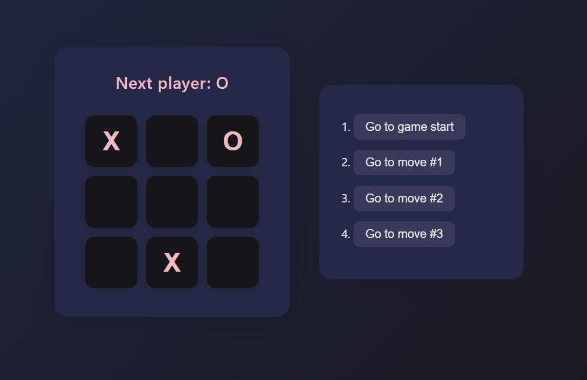

# 🕹️ Tic-Tac-Toe Game (React)

This is a simple Tic-Tac-Toe game built with React. It's based on the official React tutorial and includes features like:

- Move history tracking  
- "Time travel" to previous game states  
- Winner detection  
- Functional components with React hooks (`useState`)

---

## 🚀 Getting Started

### Clone the repo:

```bash
git clone https://github.com/YOUR_USERNAME/tic-tac-toe-react.git
cd tic-tac-toe-react
```

### Install dependencies:

```bash
npm install
```

### Start the development server:

```bash
npm start
```

Your app should now be running at [http://localhost:3000](http://localhost:3000).

---

## 🧠 Features

✅ React functional components  
✅ Game state and history with `useState`  
✅ Jump to any previous move  
✅ Conditional rendering for winner or next player  
✅ Clean UI using simple HTML/CSS

---

## 🛠 Built With

- React  
- Create React App

---

## 📸 Screenshot




---

## 📄 License

This project is licensed under the terms of the [MIT License](LICENSE).

Portions of this project are adapted from the official [React.dev Tic-Tac-Toe tutorial](https://react.dev/learn/tutorial-tic-tac-toe), © Meta Platforms, Inc., used under the MIT License.

---

## 🙌 Acknowledgements

- This project is based on the [React.dev Tic-Tac-Toe tutorial](https://react.dev/learn/tutorial-tic-tac-toe), licensed under the MIT License.
